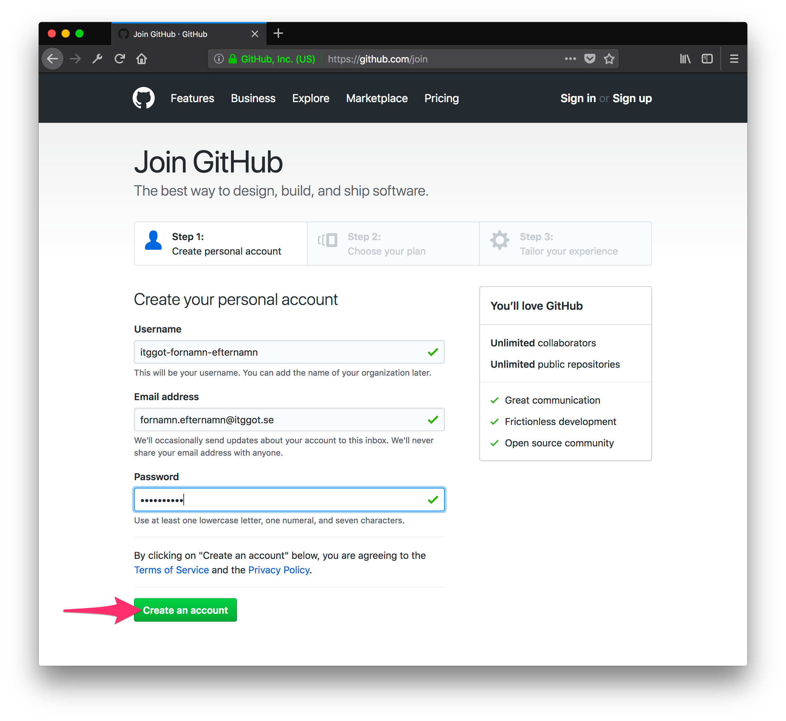
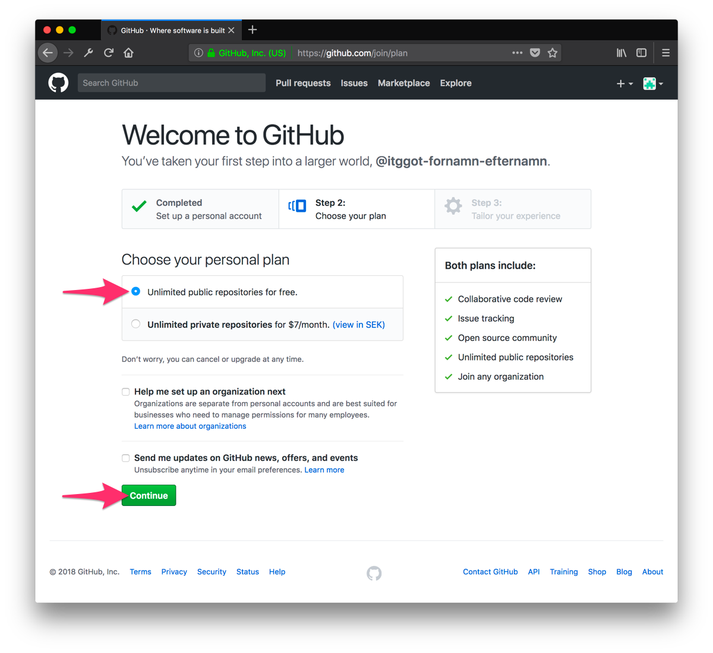
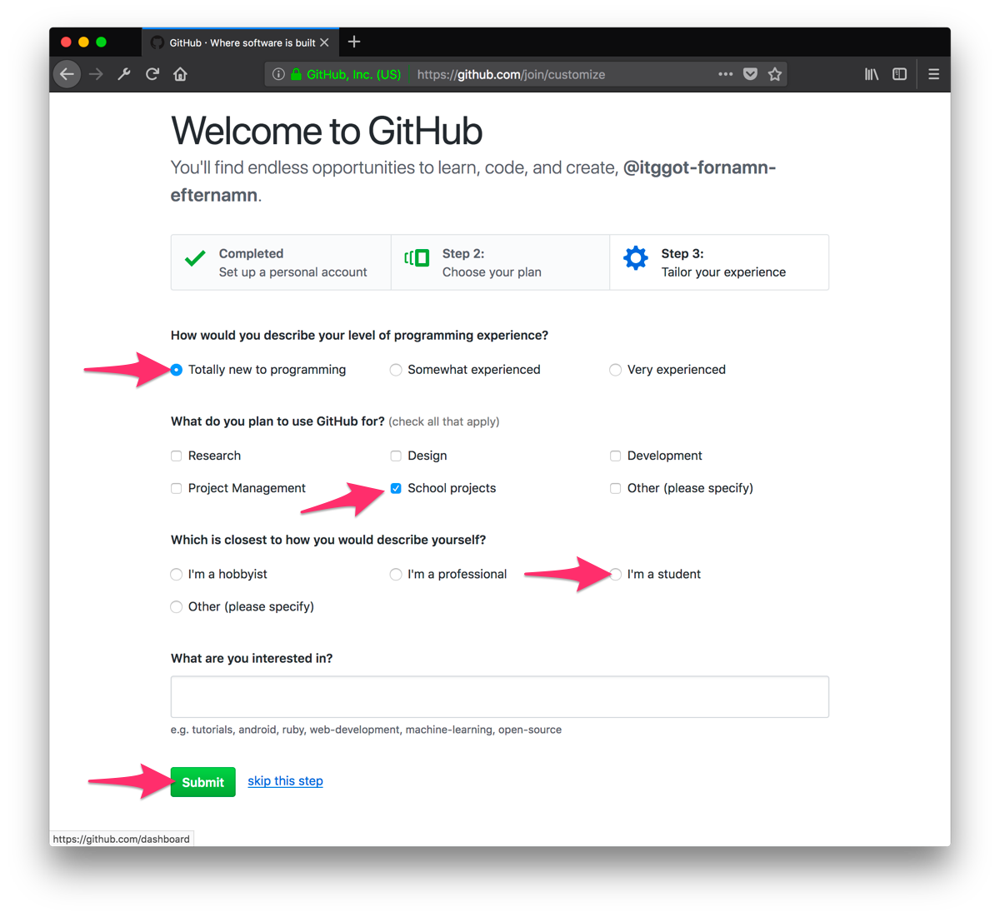
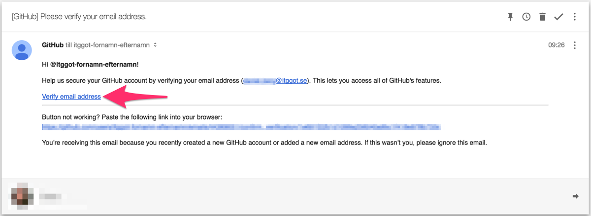
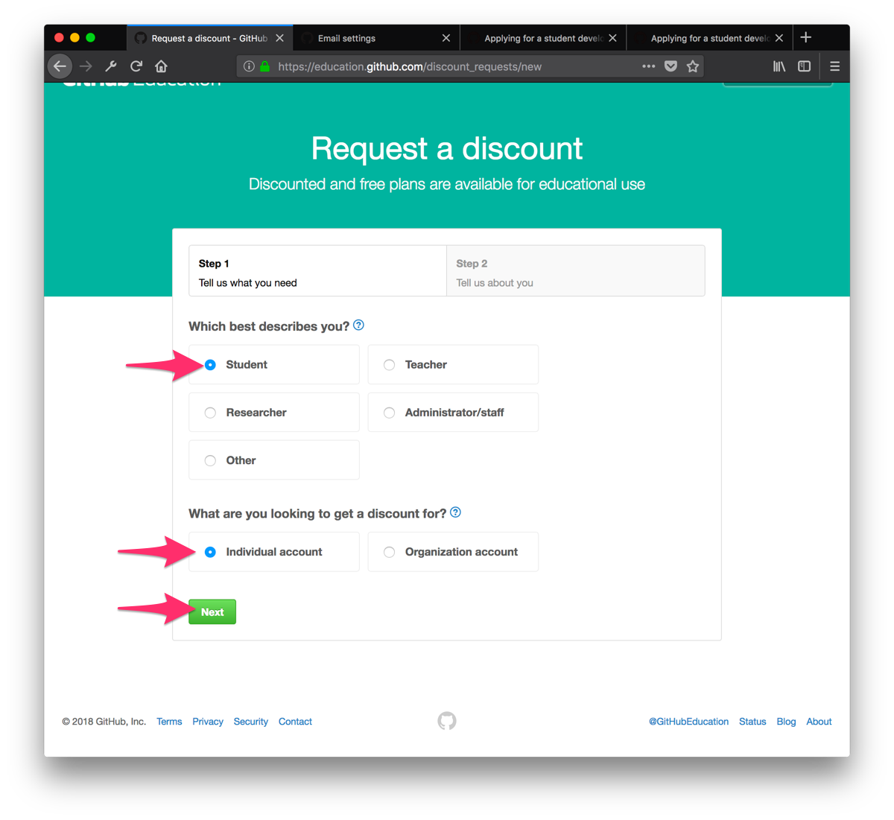
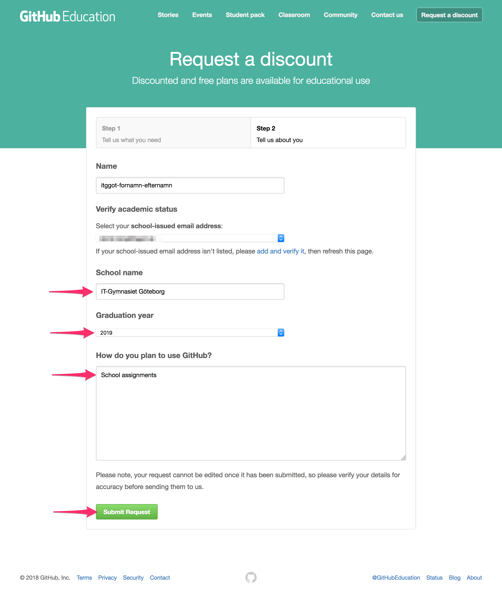
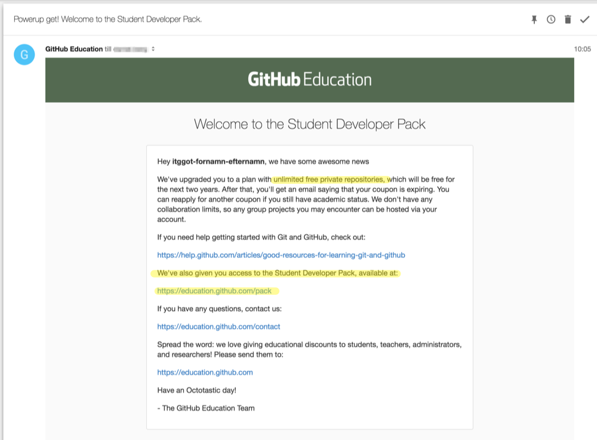

:numbered:
:icons: font
:toc: left
:toclevels: 3

= Lathund för Github

[%hardbreaks]
Git är ett så kallat versionshanteringssystem som används av en stor majoritet av utvecklare i världen.
Det är ett smidigt sätt att lagra, dela med sig och hålla koll på ändringar i utvecklingsprojekt.
Github är ett gränssnitt för git, i dessa kurser kommer ni använda github för att

* Ha backup på era projekt
* Samarbeta med varandra på olika projekt
* Dokumentera era projekt
* Göra er kod synlig för lärarna

== Skapa konto
[%hardbreaks]
Följ länken nedan för att skapa ett githubkonto.
Registrera ditt konto med din @itggot.se-adress.
Ditt användarnamn ska ha följande format, ersätt å,ä,ö med a och o.
====
itggot-fornamn-efternamn
====
https://github.com/join[Skapa konto på Github]

.Fyll i användaruppgifter, tänk på formatet på användarnamnet

.Välj gratisplanen, klicka på fortsätt

.Valfritt steg, fyll i eller klicka på skip this step

.Du behöver bekräfta din e-mail för att aktivera ditt konto

=== Student Developer Discount
[%hardbreaks]
Som student finns det ett paket med godsaker som rekommenderas.
https://education.github.com/[Student Developer Discount]

.Klicka på Request a Discount

.Välj Student och Individual Account

.Fyll i enligt bilden

.Sen får du nå mail

== Repositories
[%hardbreaks]
Alla era projekt kommer ha ett eget *repository*(som betyder *lager* på utrikiska) men brukar kallas kort och gott för *repo*.
Repon kan antingen finnas online på github.com eller lokalt på din dator, detta är viktigt att man förstår när man jobbar med github.
Varje repo är kopplat till ett github-konto som är repots ägare. Det är endast ägaren som kan göra ändringar i repot.
Om man vill lägga till att andra kan göra ändringar behöver man lägga till dem som collaborators(se nedan).

=== Skapa
När du skapar ett repo så kan du antingen göra det lokalt på din dator eller genom github.com.
Det är enklast att skapa det genom github.com och sen *klona* det med github-klienten(se längre ner).
Om du gör det lokalt på din dator behöver du publicera det så att det laddas upp på github.com.
När du gör ändringar i ditt projekt,( t.ex ändrar kod i någon fil, skapar nya filer, lägger till bilder, etc. )
så håller git reda på dessa ändringar. Men dessa ändringar är *inte sparade*.
För att *spara* sina ändringar måste man göra en *commit*.

=== Commits
När du gör en *commit* så läggs det till i ditt lokala repo som en sparad ändring.
Commits genomförs vanligtvis när man har lagt till något och fått det att fungera.
Varje commit *måste ha ett kort meddelande* som innehåller vad som har ändrats och kan innehålla en längre beskrivning.
Eftersom varje commit bara sparas i ditt lokala repo måste du publicera dessa för att spara dem på github.com.
Detta gör du genom att *synca*.

=== Synca
När du synkar så publicerar du alla commits du gjort *och* laddar ner alla ändringar som skett på det publicerade repot.
Om man är flera som jobbar med samma projekt samtidigt kan den här biten bli lite bökig om man inte är sammanspelta.
Ett typiskt scenario som det kan gå galet
====
Bob och Alice har en varsin lokal kopia av ett publicerat repo.

Alice gör en ändring i codefile.rb och lägger till några rader, sparar sin ändring med en commit, sen syncar den mot det publicerade repot.

Sen gör Bob också en ändring i codefile.rb, sparar sin ändring med en commit och försöker synca.
Men eftersom när Bob syncar sina ändringar försöker git att ladda ner Alices ändringar, då uppstår en konflikt över vilka ändringar som gäller.
För att lösa detta måste Bob ta bort sina ändringar, synca så han får ner Alices ändringar, sen lägga till sina ändringar igen följt av commit och sync.
====

=== Klona
För att få en lokal kopia av ett publicerat repo så behöver du klona det.
Detta görs enklast genom en knapp på github.com. 

När du klonar ett repo så skapas det en ny mapp med samma namn som repot på den valda sökvägen.
För att göra det enkelt så kommer alla era lokala repositories ligger under *C:\Users\user.name\Documents\GitHub\\*.

[WARNING]
====
Lägg under inga omständigheter ett repo i din Google Drive. +
Git och Google Drive är inte kompatibla.
====

=== Forka
Om du vill klona ett repo för att sedan publicera en egen version av det på ditt egna konto behöver du göra en *fork*.
Detta görs enklast genom en knapp på github.com. +
När du klickar på den så skapas ett nytt repo på ditt konto som är en kopia av det du forkade.
Det nya repot kan du sedan klona ner på din dator och börja arbeta med.

=== Collaborators
För att kunna synca ändringar mot ett publicerat repo måste du antingen vara ägare eller collaborator på det repot.
För att bli collaborator behöver ägaren gå in på github.com och gå in på repots inställningar.

=== Wiki
Varje repository har en egen dokumentationswiki. Wikin är indelad i sidor med innehåll.
Texten ni kommer skriva i dessa sidor skrivs med MarkDown som är ett enkelt språk för att formattera text.
Gränssnittet på github.com har dock knappar för olika formatteringar såsom rubriker, listor etc.

== Github Desktop Klienten
[%hardbreaks]
Det lättaste sättet att använda github är genom deras desktop applikation.
Följ länken nedan för att ladda ner den.
https://desktop.github.com/[Github Desktop]

== Vanliga Scenarion

=== Fork av en uppgift

=== Workflow under lektion

=== Dela kod med någon